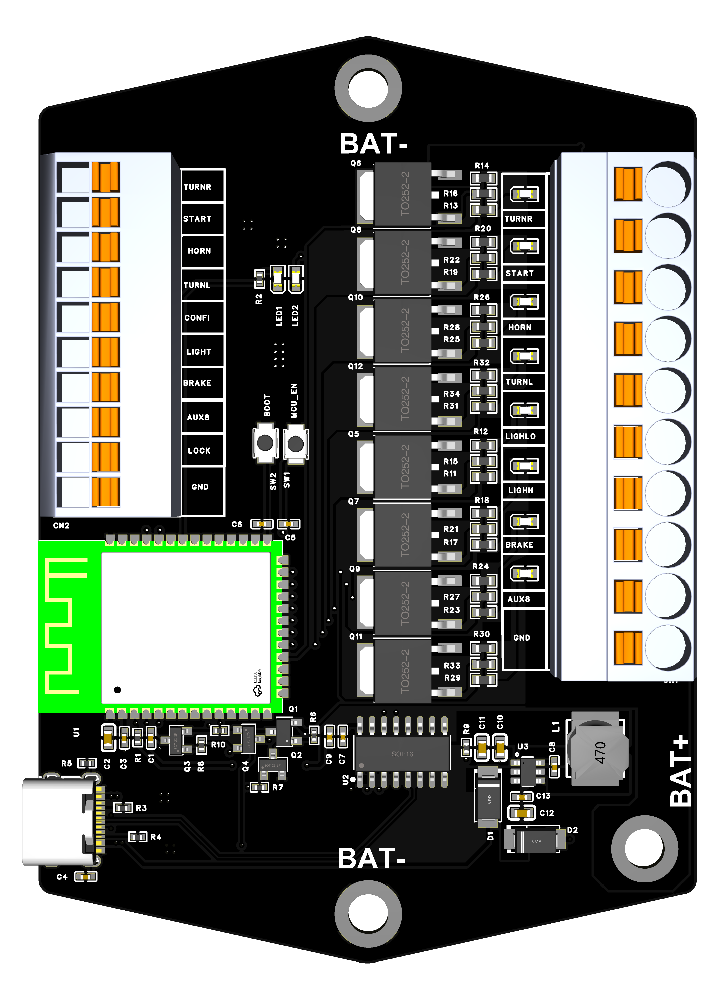
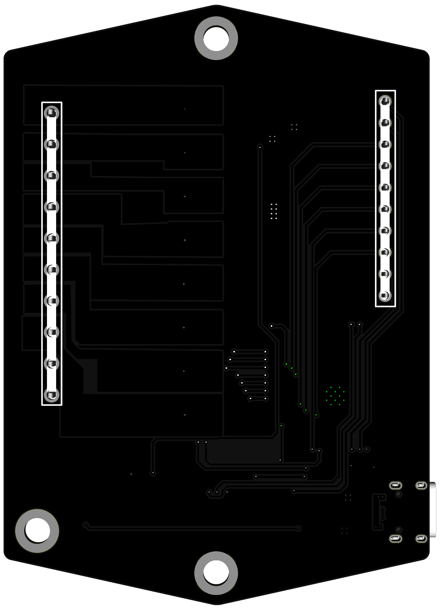
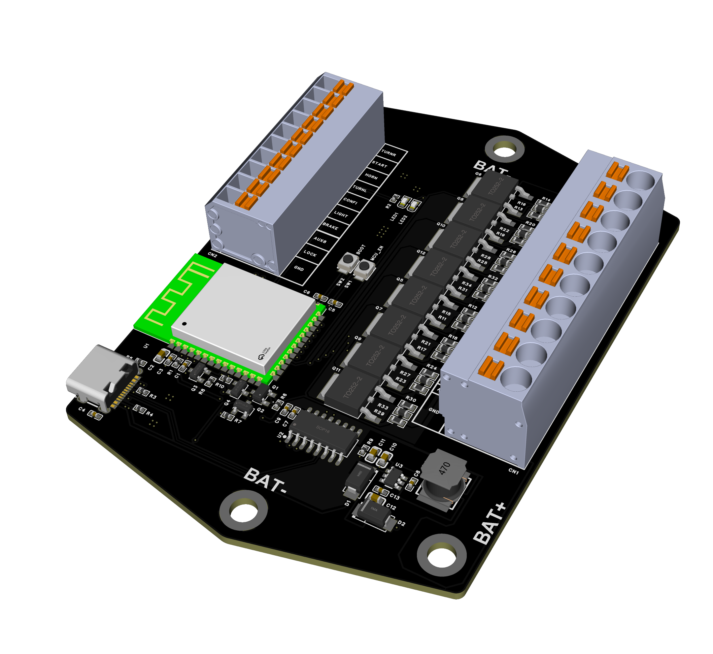
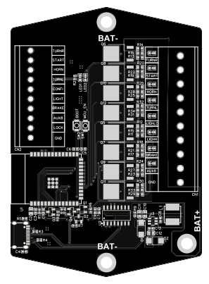
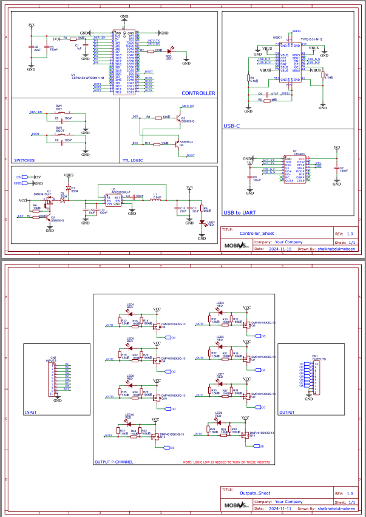

# Motogadget Clone (ESP32)

**An open-source motorcycle control unit (inspired by Motogadget M-Unit Blue), powered by ESP32.**

Complete with PCB schematics, 3D models, BOM + Pick & Place, and firmware examples.

ORDER HERE -> https://www.pcbway.com/project/shareproject/Motogadget_Clone_0a54cb40.html

---

## 📚 Overview

This project provides an open-source alternative to the **Motogadget M-Unit Blue**, designed for **custom motorcycles and DIY builders**.

- Manage all bike electronics (lights, horn, ignition, indicators).  
- MOSFET-protected outputs for durability.  
- ESP32-based firmware with potential for **Bluetooth configuration** and **CAN bus expansion**.  
- Compact PCB layout optimized for motorcycles.  

⚠️ Currently in **prototype/experimental** stage.

---

## 🖼️ PCB & 3D Models

**Top View:**  

**Bottom View:**  

**Assembled Render:**  

**3D Model Preview:**  

---

## 📜 Schematic

**Preview**

**Full PDF**: [Schematic_Canarin_MUX.pdf](Schematics/Schematic_Canarin_MUX.pdf)

---

## ⚙️ Assembly & Pick and Place

Pick and Place file is available in:  
[`BOM and Pick N Place/PickAndPlace_PCB_Canarin_MUX.csv`](BOM%20and%20Pick%20N%20Place/PickAndPlace_PCB_Canarin_MUX.csv)

---

## 📂 3D Model

The full 3D STEP file is provided for enclosure and mechanical integration:

[`3D File/3D_File.step`](3D%20File/3D_File.step)

---

## 📦 Bill of Materials (BOM)

Detailed BOM file: [`BOM_Canarin_MUX.csv`](./BOM_Canarin_MUX.csv)  
Pick & Place: [`PickAndPlace_PCB_Canarin_MUX.csv`](./PickAndPlace_PCB_Canarin_MUX.csv)  

| ID | Name    | Designator                                   | Footprint   | Quantity | Manufacturer Part   | Manufacturer | Supplier | Supplier Part | Price   |
|----|---------|----------------------------------------------|-------------|----------|---------------------|--------------|----------|---------------|---------|
| 1  | 1uF     | C1                                           | C0402       | 1        | CL05A105KANQNC      | SAMSUNG      | LCSC     | C52923        | 0.0003  |
| 2  | 22uF    | C2,C10,C11                                   | C0603       | 3        | CL10A226MQ8NRNC     | SAMSUNG      | LCSC     | C59461        | 0.0008  |
| 3  | 100nF   | C3,C5,C6,C7,C8,C9,C13                        | C0402       | 7        | CL05B104KB5NNNC     | SAMSUNG      | LCSC     | C307331       | 0.0006  |
| 4  | 10uF    | C4,C12                                       | C0603       | 2        | CL10A106MQ8NRNC     | SAMSUNG      | LCSC     | C19702        | 0.0007  |
| 5  | 10kΩ    | R1,R6,R7,R8,R10,R13,R14,R15,R16,R17          | R0402       | 10       | 0402WGF1002TCE      | UNI-ROYAL    | LCSC     | C25744        | 0.0001  |
| 6  | 100kΩ   | R2                                           | R0402       | 1        | 0402WGF1003TCE      | UNI-ROYAL    | LCSC     | C25741        | 0.0001  |
| 7  | 1kΩ     | R3,R4,R5,R9                                  | R0402       | 4        | 0402WGF1001TCE      | UNI-ROYAL    | LCSC     | C11702        | 0.0001  |
| 8  | 0Ω      | R11,R12                                      | R0402       | 2        | 0402WGF0000TCE      | UNI-ROYAL    | LCSC     | C17168        | 0.0001  |
| 9  | DMP4015SK3Q-13 | Q5,Q6,Q7,Q8,Q9,Q10,Q11,Q12            | TO-252-2    | 8        | DMP4015SK3Q-13      | DIODES       | LCSC     | C461089       | 0.507   |
| 10 | AP63203WU-7 | U3                                       | SOT-23-6    | 1        | AP63203WU-7         | DIODES       | LCSC     | C303432       | 0.112   |
| 11 | CH340C  | U2                                           | SOP-16-150  | 1        | CH340C              | WCH          | LCSC     | C75219        | 0.286   |
| 12 | ESP32-S3-WROOM-1 | U1                                  | MODULE-ESP32| 1        | ESP32-S3-WROOM-1-N8R2 | ESPRESSIF  | LCSC     | C2913205      | 2.540   |
| 13 | TYPE-C-31-M-12 | USB-C1                                | TYPE-C-31-M-12 | 1     | TYPE-C-31-M-12      | JING         | LCSC     | C165948       | 0.112   |
| 14 | SS34   | D1                                            | SMA         | 1        | SS34                | PANJIT       | LCSC     | C8678         | 0.026   |
| 15 | SOD-123FL | D2,D3                                      | SOD-123FL   | 2        | B5819W              | DIODES       | LCSC     | C8598         | 0.004   |
| 16 | TVS     | D4,D5                                        | SMC         | 2        | SMBJ58A             | LITTELFUSE   | LCSC     | C78349        | 0.064   |
| 17 | 12MHz   | X1                                           | HC-49S      | 1        | HC-49S 12MHz        | TXC          | LCSC     | C12674        | 0.026   |
| 18 | 1.5kΩ   | R18,R19                                      | R0402       | 2        | 0402WGF1501TCE      | UNI-ROYAL    | LCSC     | C25867        | 0.0001  |
| 19 | 27Ω     | R20,R21                                      | R0402       | 2        | 0402WGF270JTCE      | UNI-ROYAL    | LCSC     | C25077        | 0.0001  |
| 20 | 47kΩ    | R22                                          | R0402       | 1        | 0402WGF4702TCE      | UNI-ROYAL    | LCSC     | C25890        | 0.0001  |

---

## 🛠️ Features

- **ESP32-S3** with dual-core MCU and wireless capability.  
- **8 protected outputs** (MOSFET-based, logic low to activate).  
- **USB-C** powered programming via CH340C.  
- **Short-circuit protection** with TVS diodes and fuses.  
- **Automotive-ready connectors** for easy bike integration.  

---

## 🚀 Firmware

- **Platform**: Arduino IDE or PlatformIO  
- Current: input/output test firmware  
- Planned:  
  - Configurable mapping  
  - Short-circuit handling  
  - Bluetooth app integration  
  - CAN bus communication  

---

## 📅 Roadmap

- [x] PCB design (v1.0)  
- [x] Schematics ready  
- [ ] Firmware bring-up  
- [ ] Bench + vibration testing  
- [ ] On-bike integration  
- [ ] Community release with docs  

---

## 🙌 Sponsor

**Manufacturing Sponsor:**  
Huge thanks to **PCBWay** for sponsoring PCB fabrication.  
Their high-quality boards, fast turnaround, and great support make development much easier.  

👉 [Check PCBWay here](https://www.pcbway.com/)

---

## 📜 License

MIT License — free to use, modify, and share.  

---

## 🔗 Resources

- [ESP32 Documentation](https://docs.espressif.com/)  
- [Arduino IDE](https://www.arduino.cc/en/software)  
- [PCBWay](https://www.pcbway.com/)  

---

> _“Open source means everyone can help — collective knowledge is stronger.”_
